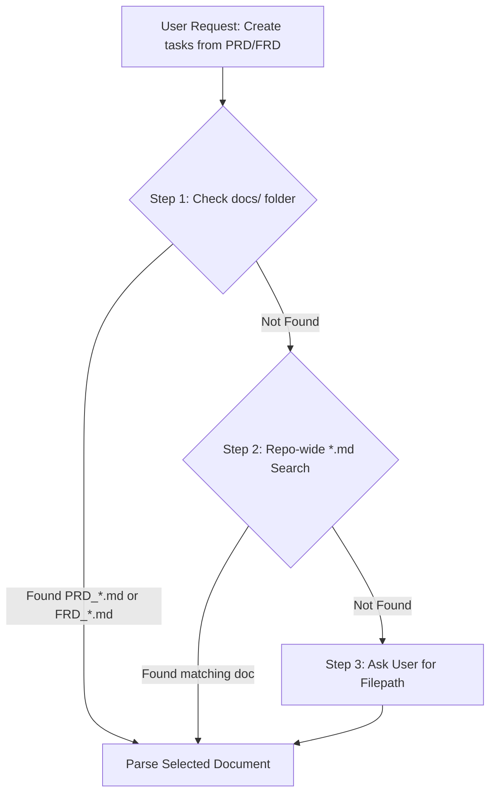
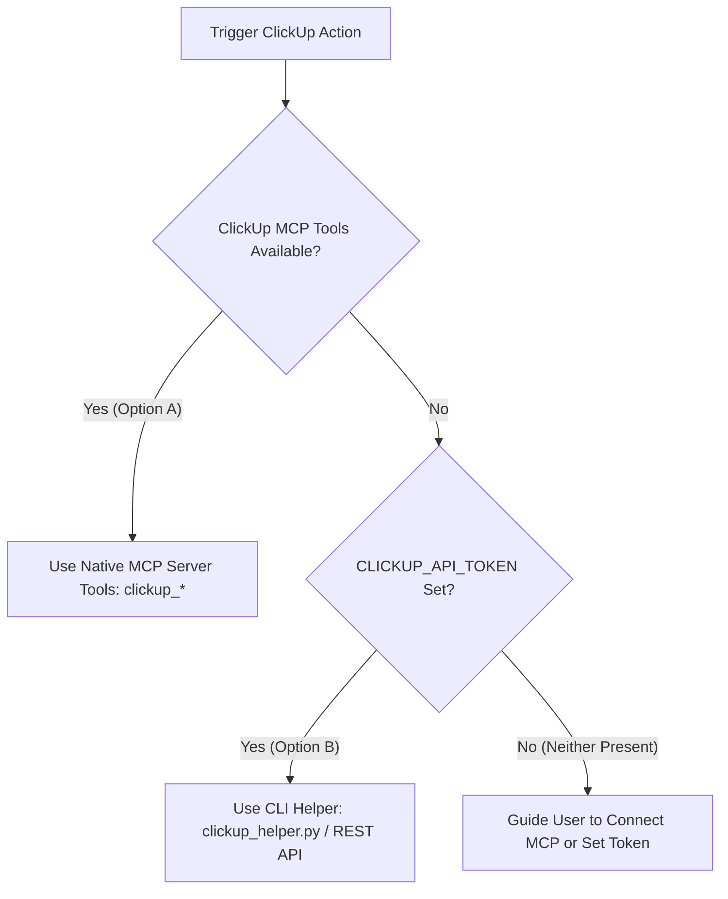

# ClickUp Skill: Comprehensive Task & Workspace Management

The **ClickUp** skill enables AI coding agents to perform complete workspace management, task lifecycle operations, assignee reassignment, priority changes, git workflow linking, and **automatic task generation from PRD / FRD specifications**.

---

## 📄 PRD / FRD to ClickUp Task Generation Protocol

When the user requests to *"create ClickUp tasks from PRD/FRD"* or *"generate ClickUp tickets from specification"*:

### 1. Document Resolution Search Strategy (3-Step Hierarchy)
The agent **MUST** follow this search order to locate the target document:



1. **Step 1: Primary `docs/` Directory Search**:
   Check `docs/` directory for any `PRD_*.md` or `FRD_*.md` files.
2. **Step 2: Repository-wide Search**:
   If not found in `docs/`, search the repository for `.md` files containing headers `# PRD:` or `# FRD:`.
3. **Step 3: User Clarification**:
   If still not found, pause and prompt the user: *"I couldn't locate a PRD/FRD document in `docs/` or the repository. Please specify the filepath."*

### 2. Task Hierarchy Generation Rules
Once the document is found:
- Create **One Parent Task** in ClickUp for the document title (`[SPEC] PRD Title`).
- Create **Subtasks** under the Parent Task for each acceptance criteria / requirement item in the document.
- Use MCP tool `clickup_create_task` (with `parent` ID) or CLI fallback `python3 clickup_helper.py create-from-doc <doc_filepath> <list_id>`.

---

## 🔌 Integration Hierarchy & Unauthenticated Handling



### 1. Option A (Preferred): ClickUp MCP Server
If a ClickUp MCP server is active in the environment, the agent invokes native MCP tools (`clickup_get_task`, `clickup_update_task`, `clickup_create_task`). **No terminal token needed.**

### 2. Option B (Fallback): API Token
If MCP is absent, the agent uses `python3 scripts/clickup_helper.py` powered by `CLICKUP_API_TOKEN`:
```bash
export CLICKUP_API_TOKEN="pk_YOUR_PERSONAL_API_TOKEN"
```

### 3. Neither Present (Diagnostic Handling)
If neither is found, the agent cleanly informs the user how to configure Option A (MCP) or Option B (API Token).

---

## Supported Operations Quick Reference

```bash
# Workspaces & Lists
python3 .agents/skills/clickup/scripts/clickup_helper.py get-workspaces
python3 .agents/skills/clickup/scripts/clickup_helper.py get-spaces <workspace_id>
python3 .agents/skills/clickup/scripts/clickup_helper.py get-lists <space_id>
python3 .agents/skills/clickup/scripts/clickup_helper.py create-list <space_id> "List Name"

# PRD / FRD Document Task Generation
python3 .agents/skills/clickup/scripts/clickup_helper.py create-from-doc <doc_filepath> <list_id>

# Task Lifecycle & Assignees
python3 .agents/skills/clickup/scripts/clickup_helper.py get <task_id>
python3 .agents/skills/clickup/scripts/clickup_helper.py create-task <list_id> "Title" "Description" priority assignee_id
python3 .agents/skills/clickup/scripts/clickup_helper.py update-status <task_id> "in review"
python3 .agents/skills/clickup/scripts/clickup_helper.py update-description <task_id> "New description..."
python3 .agents/skills/clickup/scripts/clickup_helper.py set-priority <task_id> <urgent|high|normal|low|clear>
python3 .agents/skills/clickup/scripts/clickup_helper.py reassign-user <task_id> <old_user_id> <new_user_id>
```

---

## References & Examples

- [references/mcp_setup.md](references/mcp_setup.md) — Guide for setting up ClickUp MCP server across any AI coding agent.
- [references/api_reference.md](references/api_reference.md) — ClickUp MCP tools & REST API v2 endpoints reference.
- [references/git_conventions.md](references/git_conventions.md) — Branch naming, commit messages, and PR linking conventions.
- [scripts/clickup_helper.py](scripts/clickup_helper.py) — Standalone Python CLI helper.
- [examples/sample_clickup_workflow.md](examples/sample_clickup_workflow.md) — Sample workflow transcripts including PRD task generation.
