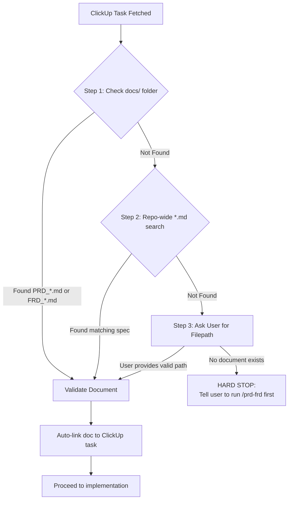

# Implement Skill: Task-Driven Feature Implementation

The **Implement** skill bridges a ClickUp task and a PRD/FRD specification into a complete, verified code implementation. It enforces a strict quality gate — **no PRD/FRD, no code** — and automatically syncs progress back to ClickUp.

---

## When to Activate This Skill

Activate when the user says:
- "implement CU-xxxx"
- "build the feature from ClickUp task CU-xxxx"
- "code this task: CU-xxxx"
- "work on CU-xxxx"

A ClickUp Task ID **must** be present. If no task ID is given, ask the user to provide one before proceeding.

---

## Step 1 — Fetch the ClickUp Task

Retrieve the full task details using whichever integration is available:

- **MCP (preferred)**: `clickup_get_task({ taskId: "CU-xxxx" })`
- **CLI fallback**: `python3 .agents/skills/clickup/scripts/clickup_helper.py get CU-xxxx`

Extract and note:
- Task title
- Description and acceptance criteria
- Priority and assignees
- Current status
- Any linked documents or references

---

## Step 2 — Sync Status: In Progress

Immediately update the ClickUp task status to **"in progress"**:

- **MCP**: `clickup_update_task({ taskId: "CU-xxxx", status: "in progress" })`
- **CLI**: `python3 .agents/skills/clickup/scripts/clickup_helper.py update-status CU-xxxx "in progress"`

---

## Step 3 — Locate and Validate the PRD/FRD (Hard Gate)

> ⛔ **This is a hard gate. Do not write any code until a matching PRD/FRD is found and validated.**

Search for the matching PRD or FRD document using the 3-step resolution strategy:

### 3-Step PRD/FRD Resolution

Same 3-step resolution strategy as the `clickup` skill (see [../clickup/SKILL.md](../clickup/SKILL.md)):

1. **Step 1**: Scan `docs/` for `PRD_*.md` or `FRD_*.md` whose title or content references the feature described in the ClickUp task.
2. **Step 2**: If not in `docs/`, search the entire repo for `.md` files containing `# PRD:` or `# FRD:` headers that match the task scope.
3. **Step 3**: If still not found, ask the user directly: *"I couldn't locate a PRD/FRD document in `docs/` or the repository. Do you have one at a different filepath?"*
   - If the user provides a valid path, validate it and proceed.
   - If the user confirms no document exists, this is a **hard stop** — do not write any code. Respond:

   > ⛔ **No PRD or FRD document was found for this task.**
   >
   > Before implementing, please run the `prd-frd` skill to generate a specification:
   > - Start a conversation or invoke `/prd-frd` to generate `docs/PRD_<feature>.md`
   > - Then retry: "implement CU-xxxx"

### Auto-Link PRD/FRD to ClickUp Task

Once the document is found, append a reference to it in the ClickUp task description:

- **MCP**: `clickup_update_task({ taskId: "CU-xxxx", description: "<existing>\n\n📄 Spec: docs/PRD_<name>.md" })`
- **CLI**: `python3 .agents/skills/clickup/scripts/clickup_helper.py update-description CU-xxxx "<existing>\n\n📄 Spec: docs/PRD_<name>.md"`

---

## Step 4 — Create the Feature Branch

Before writing any code, create (or resume) a dedicated branch for this task. This is always a new step, not optional — `implement` never writes code directly on the branch it started from.

### Branch Naming: `<type>/<slug>`

No ClickUp ID in the branch name — pure semantic, industry-standard naming (e.g. `feat/login`, `fix/pagination-offset`, `docs/v1-tech-arch`). Traceability comes from the commit message's `[CU-<task_id>]` tag (Step 7) and the PR link synced back to ClickUp (via `ship`), not from the branch name itself.

**`<type>`** — Conventional Commits vocabulary, same table `ship` uses (see [../ship/references/git_conventions.md](../ship/references/git_conventions.md)):

| Type | When |
|---|---|
| `feat` | New user-facing capability |
| `fix` | Bug fix / defect correction |
| `docs` | Documentation-only change (specs, READMEs, architecture docs) |
| `refactor` | Behavior-preserving code restructure |
| `perf` | Performance improvement |
| `test` | Test-only changes |
| `chore` | Build tooling, dependencies, config |
| `ci` | CI/CD pipeline changes |

Infer `<type>` from the ClickUp task's type/tags if set, otherwise from the PRD/FRD title and acceptance criteria (e.g. "Add real-time notifications" → `feat`; "Fix null pointer in date parser" → `fix`; "Document v1 technical architecture" → `docs`). If genuinely ambiguous, ask the user to confirm rather than guessing.

**`<slug>`** — a short (2-4 word), lowercase, kebab-case slug derived from the PRD/FRD title (preferred, since it's the validated spec) or the ClickUp task title if that reads better. Strip filler words (e.g. "Implement", "Add support for").

### Create or Resume

1. Check whether a branch matching this task already exists locally or on the remote (`git branch --list <name>` / `git ls-remote --heads origin <name>`). If so, check it out instead of creating a duplicate — this is how a resumed/re-run of the same task continues on the same branch.
2. Otherwise, branch from the repository's up-to-date default branch: `git checkout -b <type>/<slug>`.
3. If the working tree currently has unrelated uncommitted changes, stop and ask the user how to proceed rather than silently switching branches over them.

All subsequent steps happen on this branch. `ship`'s branch step later confirms this same branch rather than creating a new one.

---

## Step 5 — Understand the Codebase

Before writing any code:

1. Read the PRD/FRD document fully — note all acceptance criteria, API contracts, data types, edge cases, and non-functional requirements.
2. Explore the existing codebase relevant to this task:
   - Trace existing patterns (naming conventions, service/repository/controller structure, error handling style).
   - Identify files to create or modify.
   - Identify existing tests to understand expected behaviour.
3. If **anything is unclear** in the task description or PRD/FRD, **ask the user** before proceeding. Do not assume intent.

---

## Step 6 — Implement

Write the implementation strictly aligned to the PRD/FRD acceptance criteria:

- Follow existing code patterns, naming conventions, and project structure.
- Cover all acceptance criteria specified in the PRD/FRD — do not skip any.
- Handle all edge cases documented in the PRD/FRD.
- Add or update necessary tests alongside implementation code.
- Do not modify unrelated code or introduce unrequested changes.
- Do not introduce new dependencies without explicitly stating the reason.

---

## Step 7 — Run Smoke Tests

Once implementation is complete, apply the `smoke-test` skill:

1. The `smoke-test` skill will automatically resolve the context from the already-located PRD/FRD or ClickUp task.
2. It will generate and run targeted smoke tests covering all implemented acceptance criteria.
3. All smoke tests must pass before proceeding. If any fail, fix the implementation and re-run.

See [smoke-test skill](../smoke-test/SKILL.md) for full details.

---

## Step 8 — Sync Status: In Review

Once all smoke tests pass, update the ClickUp task status to **"in review"**:

- **MCP**: `clickup_update_task({ taskId: "CU-xxxx", status: "in review" })`
- **CLI**: `python3 .agents/skills/clickup/scripts/clickup_helper.py update-status CU-xxxx "in review"`

---

## Step 9 — Final Summary

Respond to the user with:

- ✅ Task implemented: `CU-xxxx — <Task Title>`
- 🌿 Branch: `<type>/<slug>`
- 📄 PRD/FRD used: `docs/PRD_<name>.md`
- 📁 Files created/modified: list of file paths
- 🧪 Smoke tests: X/X passing
- 🔁 ClickUp status: updated to "in review"
- Any blockers, deviations from spec, or open questions

---

## Step 10 — Offer to Ship (Optional)

After the final summary, ask the user whether to hand off to the `ship` skill:

> "Want me to ship this now — commit, push, and open a PR?"

This is always a per-run choice, never an automatic default — `implement` does not push or open a PR on its own. If the user accepts, invoke [../ship/SKILL.md](../ship/SKILL.md) with the file list and branch name from Step 9 and the ClickUp task/PRD context already resolved in this session, so `ship` does not need to re-resolve them — it commits and pushes the branch `implement` already created in Step 4. If the user declines, stop here — the task remains at ClickUp status "in review", on the branch created in Step 4, with the code changes left uncommitted, exactly as `implement` wrote them.

---

## References & Examples

- [references/prd_resolution.md](references/prd_resolution.md) — Detailed PRD/FRD resolution and validation guide.
- [examples/sample_implement_workflow.md](examples/sample_implement_workflow.md) — Sample end-to-end transcript.
- [../clickup/SKILL.md](../clickup/SKILL.md) — ClickUp task management skill.
- [../prd-frd/SKILL.md](../prd-frd/SKILL.md) — PRD/FRD generation skill.
- [../smoke-test/SKILL.md](../smoke-test/SKILL.md) — Smoke test generation and execution skill.
- [../ship/SKILL.md](../ship/SKILL.md) — Optional final step: commit, push, and open a PR.
