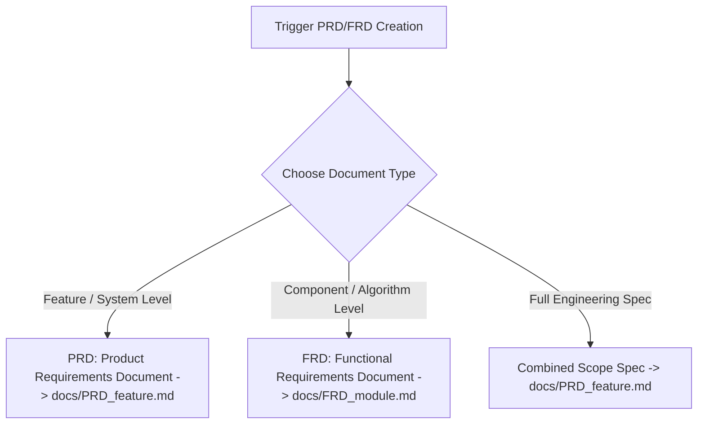

# PRD / FRD Scope Document Skill: Internal Technical Specifications

The **PRD-FRD** skill converts findings from **any conversation, design discussion, plan review, or `/grill-me` alignment session** into an exhaustive, highly descriptive **Product Requirements Document (PRD)** or **Functional Requirements Document (FRD)**.

Because this is an **internal engineering document** (never presented to clients or non-technical stakeholders), it prioritizes maximum technical depth, domain jargon, exact code interfaces, state machine diagrams, and failure-mode matrices.

---

## ⚡ Standalone & Universal Activation

> [!NOTE]
> You can invoke this skill at **ANY TIME** during any conversation—whether or not you used the `/grill-me` skill!
> 
> Works seamlessly across all granularity levels:
> 1. **Function / Algorithm Level**: Generates an FRD (`docs/FRD_module.md`) covering input signatures, boundary validations, mutability rules, and unit test vectors.
> 2. **Module / Feature Level**: Generates a PRD/FRD covering API contracts, data models, state transitions, and error handling.
> 3. **System / Product Level**: Generates an architectural PRD (`docs/PRD_feature.md`) covering component topology, DB schemas, NFRs, and failure recovery matrices.

---

## 📁 Mandatory Output Storage Rule

All generated PRD and FRD documents **MUST** be saved as `.md` files inside the **`docs/`** directory at the root of the project repository.

- If the **`docs/`** directory does not exist in the repository, create the `docs/` directory automatically.
- **Filename Naming Standard**:
  - For PRDs: `docs/PRD_<feature_name_kebab_case>.md` (e.g., `docs/PRD_realtime_notifications.md`)
  - For FRDs: `docs/FRD_<module_name_kebab_case>.md` (e.g., `docs/FRD_slugify_unicode.md`)

---

## When to Activate This Skill

Activate this skill when:
- The user asks to "write a PRD", "generate an FRD", "create a scope doc", "document this architecture", or "write an internal spec".
- A design discussion or `/grill-me` interview is complete and needs formal internal documentation.
- You need a formal technical specification to ground an upcoming implementation plan or multi-phase refactor.

---

## Key Core Directives for Internal Specifications

### 1. Internal Engineering Perspective (No Client Fluff)
- **Eliminate generic marketing language**: Do not write "Fast and user-friendly system".
- **Use precise technical jargon**: Write *"Sub-50ms p99 latency SLA, using client-side optimistic UI updates backed by an IndexedDB write-ahead log and exponential backoff retry loop."*
- Assume the target audience consists of senior developers, system architects, and tech leads.

### 2. Exhaustive Data & Interface Definitions
- Provide concrete TypeScript interfaces, SQL DDL schemas, or Proto definitions for all data structures.
- Spell out HTTP status codes, error payload schemas, header requirements, and rate limit boundaries.
- Never use vague placeholders like `// ... additional fields` or `TBD`.

### 3. State Machines & Architectural Diagrams
- Include Mermaid diagrams for state transitions, component architecture, and sequence flows.
- Define valid vs invalid state transitions explicitly.

---

## Document Types & Template Menu

1. **PRD (Product Requirements Document)**:
   Focuses on technical feature specs, user story contracts, data schemas, API endpoints, NFRs, and security boundaries.
   Read template: [references/prd_template.md](references/prd_template.md)

2. **FRD (Functional Requirements Document)**:
   Focuses on low-level module logic, function signatures, input validation algorithms, error taxonomies, and mutability rules.
   Read template: [references/frd_template.md](references/frd_template.md)

---

## References & Examples

- [references/prd_template.md](references/prd_template.md) — Comprehensive Internal PRD Template.
- [references/frd_template.md](references/frd_template.md) — Exhaustive Internal FRD Template.
- [examples/sample_internal_prd.md](examples/sample_internal_prd.md) — Sample internal PRD generated post `/grill-me`.
