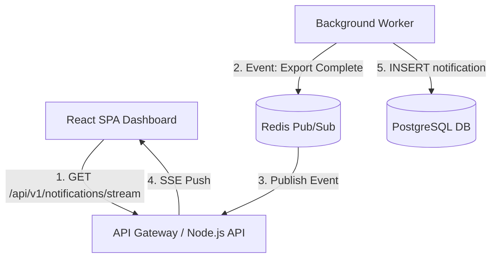

# Sample Internal Technical PRD (Post Grill-Me Alignment)

> **DOCUMENT CLASSIFICATION**: Internal Engineering Specification (Strictly Confidential)

---

# Internal PRD: Real-Time Event Delivery Engine (SSE + Redis Pub/Sub)

## 1. Technical Context & Scope Boundaries

### 1.1 Engineering Objective
Implement a unidirectional, real-time notification pipeline using Server-Sent Events (SSE) backed by a Redis Pub/Sub event bus and PostgreSQL persistent store. This system informs users when asynchronous long-running export tasks finish, eliminating client polling overhead.

### 1.2 Target System & Consumers
- **Consumers**: Frontend Web Client Dashboard (React SPA).
- **Producers**: Background Job Worker Pool (Celery / Redis Queue).

### 1.3 Out-of-Scope (Non-Goals)
- Bidirectional WebSocket communication (unidirectional SSE selected to minimize gateway state complexity).
- Push notifications to iOS/Android native mobile devices (in-app dashboard rendering only).

---

## 2. System Topology



---

## 3. Data Dictionary & Types

```typescript
export type NotificationPriority = 'LOW' | 'NORMAL' | 'HIGH' | 'URGENT';

export interface NotificationEntity {
  id: string; // UUID v4
  userId: string; // UUID v4 foreign key
  topic: string; // e.g. "EXPORT_COMPLETE"
  title: string;
  payload: {
    exportJobId: string;
    downloadUrl: string;
    fileSizeLengthBytes: number;
  };
  priority: NotificationPriority;
  readAtMs: number | null; // Nullable epoch timestamp
  createdAtMs: number; // Epoch timestamp
}
```

```sql
CREATE TABLE user_notifications (
    id UUID PRIMARY KEY DEFAULT gen_random_uuid(),
    user_id UUID NOT NULL,
    topic VARCHAR(64) NOT NULL,
    title VARCHAR(255) NOT NULL,
    payload JSONB NOT NULL DEFAULT '{}'::jsonb,
    priority VARCHAR(16) NOT NULL DEFAULT 'NORMAL',
    read_at TIMESTAMP WITH TIME ZONE NULL,
    created_at TIMESTAMP WITH TIME ZONE DEFAULT CURRENT_TIMESTAMP
);

CREATE INDEX idx_user_notifications_unread ON user_notifications(user_id) WHERE read_at IS NULL;
```

---

## 4. API Specification: `GET /api/v1/notifications/stream`

- **Transport**: Server-Sent Events (`text/event-stream`)
- **Headers Required**:
  - `Authorization`: `Bearer <JWT_TOKEN>`
  - `Accept`: `text/event-stream`
  - `Cache-Control`: `no-cache`

- **SSE Data Payload Frame**:
  ```text
  event: notification
  id: 987f6543-e21b-12d3-a456-426614174999
  data: {"id":"987f6543-e21b-12d3-a456-426614174999","topic":"EXPORT_COMPLETE","payload":{"downloadUrl":"https://cdn.app.internal/exports/123.csv"},"createdAtMs":1776412800000}
  ```

---

## 5. Non-Functional Requirements & Edge Case Handling

### 5.1 Performance SLAs
- **Push Latency**: Event publish-to-client push latency p99 < 80ms.
- **Connection Capacity**: Single Node API instance supports 10,000 idle concurrent SSE connections with memory footprint < 1.2GB.

### 5.2 Failure Mode Recovery Matrix

| Failure Mode | Trigger | System Impact | Handler / Recovery Protocol |
| :--- | :--- | :--- | :--- |
| **Redis Pub/Sub Partition** | Network glitch between API node and Redis cluster | In-flight events missed during partition | Client reconnect handler detects dropped stream and executes `GET /api/v1/notifications?unread=true` fallback fetch |
| **SSE Reconnect Storm** | Backend API rolling deployment closes 50,000 streams simultaneously | High reconnect request spike on Gateway | Client SDK executes exponential backoff with random jitter (`base=100ms`, `max=30000ms`, `jitter=0.5`) |
