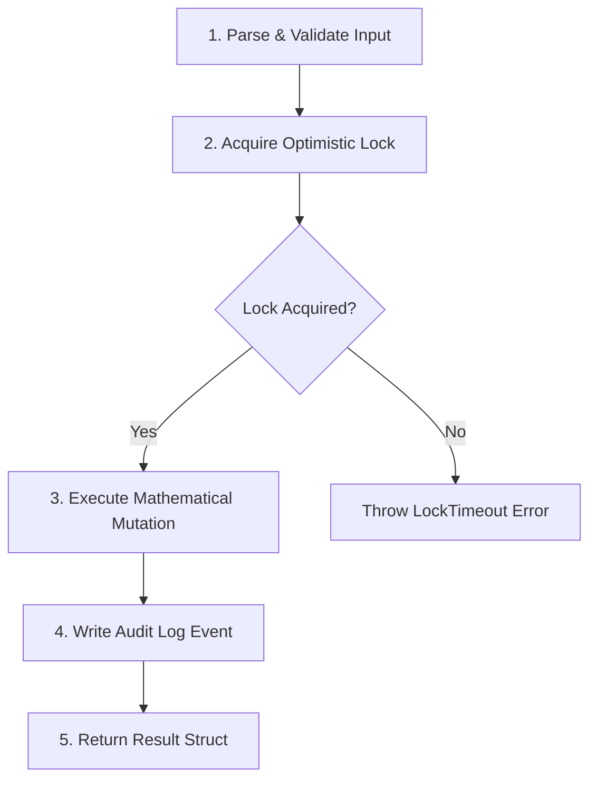

# Internal Functional Requirements Document (FRD) Template

> **DOCUMENT CLASSIFICATION**: Low-Level Engineering Functional Specification (Internal Engineering Only)

---

# Internal FRD: [Module / Component / Utility Name]

## 1. Functional Scope & Module Boundaries

### 1.1 Module Summary
Detailed technical specification of the function, module, component, or algorithm logic being implemented or refactored.

### 1.2 Module Responsibility & Invariants
- **Primary Responsibility**: Single responsibility principle definition.
- **Invariants**: Conditions that MUST hold true before, during, and after module execution (e.g., *“Input array is never mutated in-place; return object is guaranteed non-null.”*).

---

## 2. Low-Level Function Contracts & Signatures

```typescript
/**
 * Executes core business algorithm for [ModuleName].
 *
 * @param input - Validated input payload containing account & configuration options.
 * @param context - Execution context containing logger, telemetry tracer, and DB pool connection.
 * @returns Promise resolving to ProcessingResult struct.
 * @throws {InvalidInputException} If input fails regex validation or boundary bounds.
 * @throws {DatabaseLockTimeoutException} If row lock cannot be acquired within 2000ms.
 */
export async function executeModuleLogic(
  input: ProcessingInput,
  context: ExecutionContext
): Promise<ProcessingResult>;
```

### 2.1 Input Validation Algorithm
1. **Pre-condition Checks**:
   - Assert `input.id` matches UUID v4 regex pattern: `/^[0-9a-f]{8}-[0-9a-f]{4}-4[0-9a-f]{3}-[89ab][0-9a-f]{3}-[0-9a-f]{12}$/i`.
   - Assert `input.payloadSize` is between `1` and `5,242,880` bytes (5MB max).
2. **Sanitization Logic**:
   - Strip unsafe control characters `\u0000-\u001F` except newlines.
   - Escape HTML entities if payload contains string fields destined for DOM rendering.

---

## 3. Algorithmic Step-by-Step Logic



### 3.1 Step 1: Input Deserialization & Pre-flight Validation
- Read payload from memory buffer.
- Perform fast-fail pre-check. If invalid, throw `InvalidInputException` with code `ERR_VAL_01`.

### 3.2 Step 2: Atomic Execution & State Mutation
- Open database transaction (`BEGIN TRANSACTION ISOLATION LEVEL READ COMMITTED`).
- Acquire lock: `SELECT status, version FROM records WHERE id = $1 FOR UPDATE NOWAIT`.
- Calculate mutated state: `new_value = old_value + payload.delta`.
- Verify bounds: `assert(new_value >= 0, "Account balance cannot go negative")`.

### 3.3 Step 3: Transaction Commit & Event Dispatch
- Commit database transaction (`COMMIT`).
- Dispatch async event to local event emitter `eventEmitter.emit('record:mutated', payload)`.

---

## 4. Error Code Taxonomy & Exception Handling

| Error Code Enum | Exception Type | HTTP / CLI Status | Retry Strategy | Log Level |
| :--- | :--- | :--- | :--- | :--- |
| `ERR_VAL_01` | `InvalidInputException` | `400 Bad Request` | Non-retryable | `WARN` |
| `ERR_LOCK_02` | `LockTimeoutException` | `409 Conflict` | Retry 3x with jitter (100ms, 200ms, 400ms) | `WARN` |
| `ERR_DB_03` | `DatabaseQueryException` | `500 Internal Error` | Retry 2x | `ERROR` |
| `ERR_FATAL_04` | `SystemInvariantException` | `500 Internal Error` | Non-retryable (Alert On-Call) | `FATAL` |

---

## 5. Verification & Test Vector Specifications

### 5.1 Unit Test Coverage Matrix
- **Boundary Test 1**: Empty string input (`""`) -> Must return `ERR_VAL_01`.
- **Boundary Test 2**: Maximum integer boundary (`Number.MAX_SAFE_INTEGER + 1`) -> Must catch overflow.
- **Concurrency Test 3**: Spawn 50 parallel workers mutating the same entity -> Verify zero lost updates (atomic serialization).

### 5.2 Performance Test Specifications
- **Micro-benchmark**: `executeModuleLogic()` execution time must be under `1.5ms` per 1,000 iterations in V8 runtime.
