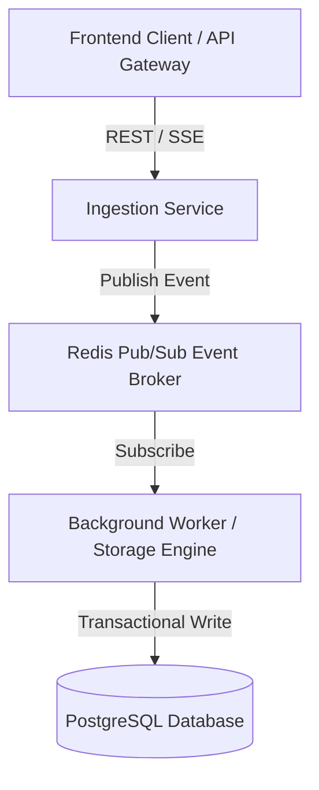
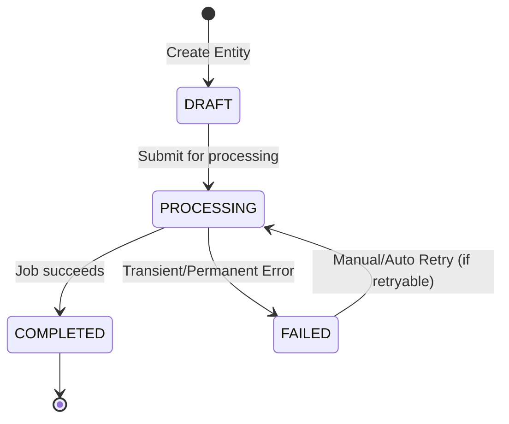

# Internal Product Requirements Document (PRD) Template

> **DOCUMENT CLASSIFICATION**: Internal Engineering Specification (Strictly Confidential - Technical Team Only)

---

# Internal PRD: [Project / Feature Name]

## 1. Technical Context & Scope Boundaries

### 1.1 Problem & Engineering Objective
Deep technical summary of what problem this system/feature solves, the underlying system bottlenecks, and architectural objectives.

### 1.2 Target System & Consumers
List internal microservices, developer teams, or frontend clients consuming this feature.

### 1.3 Out-of-Scope (Non-Goals)
Explicit list of technical capabilities intentionally excluded from this milestone to preserve scope boundaries.

---

## 2. System Architecture & Component Topology



### 2.1 Component Decomposition
- **Ingestion Boundary**: Responsibilities, input sanitization, rate-limiting handlers.
- **Processing Layer**: Business logic, transactional guarantees, state management.
- **Persistence Layer**: Primary data store, cache layers, retention/cleanup jobs.

---

## 3. Data Dictionary & Schema Definitions

Provide complete, unabridged TypeScript interfaces or SQL DDL statements:

```typescript
/**
 * Primary domain entity representing [FeatureName] state.
 */
export interface FeatureEntity {
  /** Unique UUID v4 primary identifier */
  id: string;
  /** Foreign key pointing to tenant account */
  accountId: string;
  /** Current state enum */
  status: 'PENDING' | 'PROCESSING' | 'COMPLETED' | 'FAILED';
  /** Idempotency key supplied by client header */
  idempotencyKey: string;
  /** Epoch timestamp in milliseconds when created */
  createdAtMs: number;
  /** Optional failure context payload */
  errorContext?: {
    code: string;
    message: string;
    retryable: boolean;
  };
}
```

```sql
-- PostgreSQL Table DDL
CREATE TABLE feature_entities (
    id UUID PRIMARY KEY DEFAULT gen_random_uuid(),
    account_id UUID NOT NULL,
    status VARCHAR(32) NOT NULL DEFAULT 'PENDING',
    idempotency_key VARCHAR(128) UNIQUE NOT NULL,
    payload JSONB NOT NULL DEFAULT '{}'::jsonb,
    created_at TIMESTAMP WITH TIME ZONE DEFAULT CURRENT_TIMESTAMP,
    updated_at TIMESTAMP WITH TIME ZONE DEFAULT CURRENT_TIMESTAMP
);

CREATE INDEX idx_feature_entities_account_status ON feature_entities(account_id, status);
```

---

## 4. API & Transport Contracts

### 4.1 Endpoint Specification: `POST /api/v1/resource`

- **Headers**:
  - `Authorization`: `Bearer <JWT_TOKEN>`
  - `Idempotency-Key`: `UUID_v4`
  - `Content-Type`: `application/json`

- **Request Body**:
  ```json
  {
    "accountId": "123e4567-e89b-12d3-a456-426614174000",
    "targetAction": "SYNC_DATA",
    "options": {
      "timeoutMs": 5000,
      "forceRefresh": false
    }
  }
  ```

- **Success Response (`201 Created`)**:
  ```json
  {
    "success": true,
    "data": {
      "id": "987f6543-e21b-12d3-a456-426614174999",
      "status": "PENDING"
    }
  }
  ```

- **Error Taxonomy**:
  | Status Code | Error Code Enum | Cause / Trigger | Mitigation / Client Action |
  | :--- | :--- | :--- | :--- |
  | `400` | `INVALID_PAYLOAD` | Missing required fields or schema validation failure | Fix body & retry |
  | `409` | `IDEMPOTENCY_CONFLICT` | Re-using key with different request payload | Regenerate idempotency key |
  | `429` | `RATE_LIMIT_EXCEEDED` | Request count exceeds 100 req/min limit | Backoff using `Retry-After` header |
  | `503` | `SERVICE_DEGRADED` | Database pool exhausted or downstream dependency down | Exponential jitter retry |

---

## 5. State Machine & Execution Flow



### State Transition Matrix
- **State `DRAFT` -> `PROCESSING`**: Triggered by ingestion service. Acquires row lock (`SELECT FOR UPDATE`).
- **State `PROCESSING` -> `COMPLETED`**: Idempotent mutation. Dispatches event to message bus.
- **State `PROCESSING` -> `FAILED`**: Logs stack trace, increments retry counter. If `retry_count >= 3`, transitions to DLQ (Dead Letter Queue).

---

## 6. Non-Functional Requirements (NFRs)

- **Latency Budget**: Latency p95 < 100ms, p99 < 250ms for read queries; p95 < 300ms for write queries.
- **Throughput & Concurrency**: Handles 5,000 sustained QPS; pessimistic locking scoped strictly per account partition.
- **Security & Authorization**: RBAC enforced via API Gateway JWT claim validation (`claims.permissions.includes('feature:write')`).
- **Observability**: Prometheus metrics emitted: `feature_execution_latency_seconds_bucket`, `feature_error_count_total{code="..."}`. All log events structured JSON with `correlation_id`.

---

## 7. Exhaustive Edge Case & Failure Mode Matrix

| Edge Case / Failure Mode | Root Cause / Trigger | Technical Impact | Mitigating Handler Strategy |
| :--- | :--- | :--- | :--- |
| **Db Deadlock during batch update** | Concurrent workers updating records in reverse primary key order | Transaction aborted (`40001`) | Enforce deterministic primary key sorting before batch `SELECT FOR UPDATE` |
| **Worker OOM crash during large export** | Memory footprint spikes when serializing 100k items in RAM | Node/Process killed | Stream records using DB cursor (`pg-query-stream`) in chunks of 500 items |
| **Stale Cache Read after Mutation** | Cache invalidation race condition | Client sees outdated state | Write-through cache invalidation pattern with short TTL (30s fallback) |
