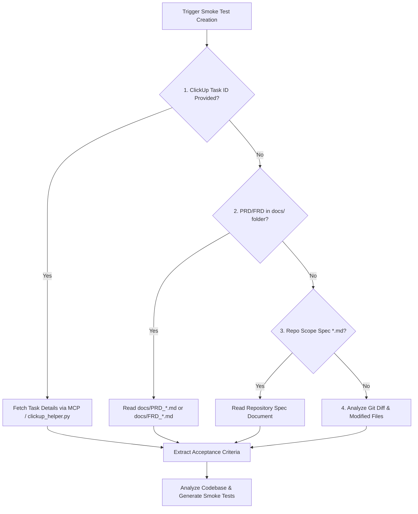

# Smoke-Test Skill: Automated Requirement Verification & Test Generation

The **Smoke-Test** skill enables AI coding agents to read requirements from **whichever source is available at first hand** (ClickUp task, FRD, PRD, or git diff), analyze the implemented code, generate executable smoke test cases covering all specified functionalities, and execute the test runner to verify 100% pass rate.

---

## When to Activate This Skill

Activate this skill when:
- The user requests to "run smoke test", "create smoke tests", "verify implementation against requirements", or "write test cases from FRD/PRD/ClickUp".
- After completing code edits for a feature, module, or bug fix.
- You need automated sanity/smoke test verification before opening a Pull Request.

---

## 🔍 Step 1: Context Resolution Hierarchy (First Available Source Wins)

The agent **MUST** check for requirement sources in this priority order. **Any single available source is sufficient**:

1. **Source 1: ClickUp Task ID**: If a ClickUp Task ID (`CU-xxxx` or `#xxxx`) is mentioned in the prompt or branch name, fetch task description and acceptance criteria via ClickUp MCP or `clickup_helper.py get <id>`.
2. **Source 2: `docs/` Specification**: Look in `docs/` for `PRD_*.md` or `FRD_*.md`.
3. **Source 3: Repository Spec**: Search the repository for any `.md` file containing specification headers.
4. **Source 4: Git Diff**: If no document or ClickUp ticket exists, inspect changed files via `git diff` / modified files list.

---

## 🧠 Step 2: Codebase & Requirement Alignment Analysis

Once requirements are extracted from the resolved context source:
1. **Map Requirements to Code**: Map each acceptance criteria / requirement item to the target source code file, function symbol, API route, or UI component.
2. **Coverage Audit**: Identify happy path scenarios, boundary inputs (`null`, empty, zero, invalid formatting), and expected HTTP status codes / error types.

---

## 🛠️ Step 3: Smoke Test Suite Generation

Generate fast, lightweight, non-destructive smoke tests matching the repository's test framework:

- **Framework Detection**: Inspect `package.json` (`jest`, `vitest`, `mocha`), `pytest.ini` / `pyproject.toml` (`pytest`), `go.mod` (`go test`), or bash scripts.
- **Test File Location**: Save generated tests under the project's standard test folder (e.g., `tests/smoke/`, `__tests__/smoke.test.ts`, `tests/test_smoke.py`).
- **Test Qualities**:
  - Independent & isolated (no dependency on external production state).
  - Fast execution (< 5 seconds total runtime).
  - Explicit assertions for every requirement item specified in the context source.

---

## 🚀 Step 4: Execution & Verification

Run the test suite immediately after writing the code:
- Node / TS: `npm test` or `npx jest tests/smoke`
- Python: `pytest tests/smoke/`
- Go: `go test ./...`

Confirm all tests pass cleanly before concluding.

---

## References & Examples

- [references/context_resolution.md](references/context_resolution.md) — Guide for resolving requirements from ClickUp, PRDs, FRDs, or Git diffs.
- [references/smoke_test_guidelines.md](references/smoke_test_guidelines.md) — Testing patterns for Jest, Vitest, Pytest, Go, and cURL API tests.
- [examples/sample_smoke_test_generation.md](examples/sample_smoke_test_generation.md) — Sample end-to-end transcript.
